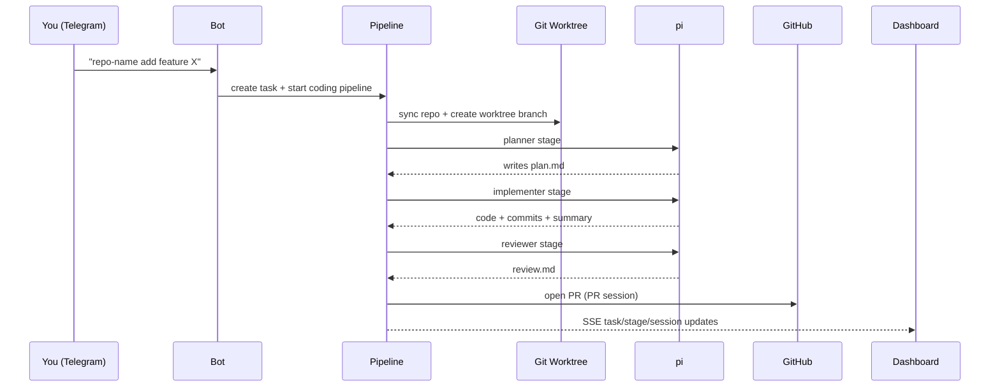

# goodboy

Goodboy is a self-hosted coding agent you control from Telegram.
You send a message like `repo-name fix the flaky auth refresh`, and it runs a staged AI pipeline (plan → implement → review), opens a PR, then keeps watching PR comments and can push follow-up fixes.

It also ships with a live dashboard so you can watch every stage, log line, artifact, and PR-session run in real time.

## What this repo includes

- Telegram bot (single-user, intent-classified)
- Hono API + SSE server
- React dashboard (served by the same backend)
- Task pipelines for:
  - coding tasks
  - codebase Q&A
  - PR-session automation after PR creation
- Drizzle + Neon persistence
- pi RPC integration with persistent JSONL session logs
- Optional OpenTelemetry tracing to Logfire

## Current task kinds

| Kind | Status | Stages | Output |
|---|---|---|---|
| `coding_task` | implemented | `planner` → `implementer` → `reviewer` | code commits, `plan.md`, `implementation-summary.md`, `review.md`, PR session |
| `codebase_question` | implemented | `answering` | `answer.md` + Telegram response |
| `pr_review` | stubbed (not active yet) | `pr_reviewing` | currently returns not implemented |

## Architecture (high level)

```mermaid
graph TD
  TG[Telegram User] --> BOT[Grammy Bot + Intent Classifier]
  BOT --> PIPE[Pipelines]
  PIPE --> PI[pi RPC Sessions]
  PI --> ART[artifacts/* + session JSONL]
  PIPE --> DB[(Neon Postgres via Drizzle)]

  UI[Dashboard SPA] --> API[Hono API]
  UI --> SSE[/api/events SSE]
  API --> DB
  API --> ART
  SSE --> UI

  PIPE --> GH[Git/GitHub via gh + worktrees]
```

## Runtime flow for a coding task



## Project layout

```text
src/
  index.ts                # entrypoint: Hono + Telegram + poller + shutdown
  telegram/               # bot wiring, classifier, handlers
  api/                    # REST + SSE
  db/                     # schema, db singleton, queries
  shared/                 # config, logger, events, shared types
  core/                   # stage runner, pi RPC, worktrees, GitHub helpers, session tailing
  pipelines/              # coding, question, pr-review (stub), pr-session, cleanup
  observability/          # Logfire + OTel bridge (optional)

dashboard/src/            # Vite React SPA
artifacts/                # per-task artifacts + stage session logs
pi-assets/                # assets copied into worktrees (.pi)
```

## Tech stack

- **Backend:** Node.js + TypeScript, Hono, Grammy
- **Frontend:** React 19, Vite 8, Tailwind v4
- **DB:** Drizzle ORM + Neon Postgres (HTTP driver)
- **Agent runtime:** `pi --mode rpc`, JSONL session files, planner subagents via `pi-subagents`
- **Infra:** single process serving API + dashboard on one port
- **Observability (optional):** OpenTelemetry + Pydantic Logfire

## Why it feels fast in practice

- No separate frontend server in production (same Hono server serves SPA + API)
- SSE for live updates (no polling loops for UI refresh)
- Worktrees instead of full clones for task isolation
- Artifact files between stages (inspectable + retry-friendly)

## Quick start

### 1) Prerequisites

- Node 20+
- `pi` CLI installed and available in PATH
- `gh` CLI authenticated
- Neon Postgres database
- Telegram bot token + your Telegram user ID

### 2) Configure env

Copy `.env.example` to `.env` and fill required values:

- `INSTANCE_ID`
- `TELEGRAM_BOT_TOKEN`
- `TELEGRAM_USER_ID`
- `DATABASE_URL`
- `GH_TOKEN`
- `FIREWORKS_API_KEY`
- `REGISTERED_REPOS` (JSON map of repo names to local paths)

Example:

```env
REGISTERED_REPOS={"myrepo":{"localPath":"/Users/you/code/myrepo","githubUrl":"https://github.com/you/myrepo.git"}}
```

### 3) Run locally

```bash
npm ci
npm run dev
```

- Backend/API + bot run via `tsx watch`
- Dashboard runs via `vite build --watch`
- Default host/port: `0.0.0.0:3333`

### 4) Build and start

```bash
npm run build
npm run start
```

## Core commands

```bash
npm run dev
npm run dev:server
npm run dev:dashboard
npm run build
npm run start

npm run db:generate
npm run db:migrate
npm run db:push
npm run db:studio
```

## Deployment

Production is expected on the EC2 host via one command:

```bash
ssh goodboy && ./deploy-goodboy.sh
```

This pulls latest code, installs deps, builds, and restarts the systemd service.

## API surface (dashboard-facing)

- `GET /api/tasks`
- `GET /api/tasks/:id`
- `GET /api/tasks/:id/session`
- `POST /api/tasks/:id/retry`
- `POST /api/tasks/:id/cancel`
- `POST /api/tasks/:id/dismiss`
- `GET /api/repos`
- `GET /api/prs`
- `GET /api/pr-sessions`
- `GET /api/pr-sessions/:id`
- `GET /api/pr-sessions/:id/session`
- `GET /api/events` (SSE)

## Observability

If `LOGFIRE_TOKEN` is set, each pipeline/stage/session emits OTel spans to Logfire.
If token is unset, observability becomes a no-op.

See `src/observability/README.md` for details and query patterns.

## Notes and constraints

- Single-user Telegram auth model by design
- `pr_review` intent currently exists in schema/types, but execution path is intentionally stubbed
- Every DB read is instance-scoped via `INSTANCE_ID` for prod/dev isolation
- Stage timeout defaults to 30 minutes
- Inter-stage contract is file-based (`artifacts/<taskId>/...`), not in-memory

---

If you want the shortest mental model: this is a personal, production-usable “AI junior dev loop” that runs through Telegram, shows everything in a dashboard, and keeps iterating on PR feedback without babysitting.