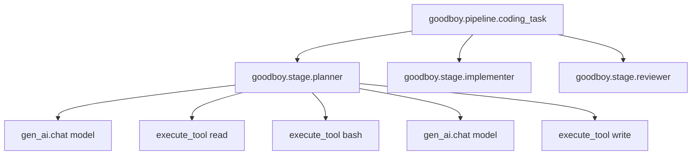

# observability

Ships every pi agent run to **Pydantic Logfire** as an OpenTelemetry trace. Zero changes outside this directory wire it into your dashboard — Logfire uses SQL-over-spans, so cost/latency/tool-error analytics fall out of the attribute set below.

## File map

```
observability/
  index.ts           public surface (init, withPipelineSpan, withStageSpan, bridgeSessionToOtel)
  logfire.ts         one-shot Logfire config + graceful shutdown
  tracer.ts          getTracer() -- the only place we touch `@opentelemetry/api.trace`
  attributes.ts      attribute-name constants (GenAi.*, Goodboy.*) + truncate()
  spans.ts           withPipelineSpan / withStageSpan wrappers
  bridge/
    types.ts         SpanCommand discriminated union + TranslatorState
    translate.ts     pure FileEntry -> SpanCommand[]  (no OTel, no IO)
    index.ts         IO adapter: tails a pi JSONL -> live OTel spans
```

Dependency rule: **no file outside `src/observability/` imports `@pydantic/logfire-node` or `@opentelemetry/*`**. Swapping Logfire for Langfuse / Phoenix / self-hosted OTLP is a one-file change (`logfire.ts`).

## Env vars

| Name | Default | Effect |
|---|---|---|
| `LOGFIRE_TOKEN` | unset | Required to actually export spans. Unset = SDK no-ops (`sendToLogfire: "if-token-present"`). |
| `INSTANCE_ID` | — | Used as `deployment.environment` on every span. Already required by `shared/runtime/config.ts`. |

That's it. No kill switch flag; unsetting the token disables everything.

## Span tree produced per task



- **pipeline** span: one per user-visible task. Attrs: `goodboy.task_id`, `goodboy.pipeline.kind`, `goodboy.repo`, `gen_ai.conversation.id`.
- **stage** span: one per pi invocation. Attrs: `goodboy.stage`, `gen_ai.request.model`, `gen_ai.agent.name`, `goodboy.pi_session_path`, rolling `goodboy.cost_usd`.
- **gen_ai.chat** span: one per assistant turn (pi writes one per LLM call). Attrs: full `gen_ai.usage.*`, `goodboy.cost_usd` for just that turn, `goodboy.stop_reason`, `gen_ai.response.finish_reasons`. Events: `assistant.text`, `assistant.thinking` (each truncated to 2 KB).
- **execute_tool** span: one per `toolCall` in an assistant message. Attrs: `gen_ai.tool.name`, `gen_ai.tool.call.id`, `goodboy.tool.args` (truncated 8 KB), `goodboy.tool.output` (truncated 2 KB), `goodboy.tool.is_error`. Error status if the tool result was an error.

PR sessions emit one root trace per *turn* (create / resume / review), tagged with `goodboy.pr_session.id` + `goodboy.pr_session.run_id` so you can group them in Logfire.

## Looking up a trace

In the Logfire SQL explorer:

```sql
-- All spans for a specific task
SELECT * FROM records WHERE attributes->>'goodboy.task_id' = '<task uuid>';

-- Total spend per repo this week
SELECT attributes->>'goodboy.repo' AS repo, SUM((attributes->>'goodboy.cost_usd')::float)
FROM records
WHERE start_timestamp > now() - interval '7 days'
  AND span_name LIKE 'goodboy.stage.%'
GROUP BY 1 ORDER BY 2 DESC;

-- Tool error rate
SELECT attributes->>'gen_ai.tool.name' AS tool,
       count(*) FILTER (WHERE status_code = 'error')::float / count(*) AS err_rate
FROM records
WHERE span_name LIKE 'execute_tool %'
GROUP BY 1;
```

Logfire's Live view also groups by `gen_ai.conversation.id`, so filtering to one task shows the whole waterfall in real time as pi writes the JSONL.

## Disable / rollback

Unset `LOGFIRE_TOKEN` and restart. `sendToLogfire: "if-token-present"` means the SDK does nothing. The bridge still runs (parses the JSONL and emits into a no-op provider), cost: negligible. To fully remove, revert the commits touching `src/core/stage.ts`, the three pipeline entry points, and `src/index.ts`; delete this directory.

## Swapping the backend

Everything routes through `logfire.configure()` in `logfire.ts`. For a different OTLP endpoint (Langfuse, Grafana Tempo, Phoenix), replace that call with a `NodeSDK` construction pointing at the new endpoint. Nothing else in the repo changes — all other code only touches `@opentelemetry/api`.

## What's intentionally out of scope

- Full prompt/response content in attributes. Text goes on events only (truncated). Full transcript is on disk at `goodboy.pi_session_path`.
- Correlation of `createLogger()` text logs with traces. Node logs keep going to stdout/journald.
- Auto-instrumentation of Hono, pg, Telegram. Would bury agent traces in noise.
- Metrics (counters, histograms). Logfire derives what we need from span attributes.
- Sampling. Currently 100%; revisit when volume demands it.
